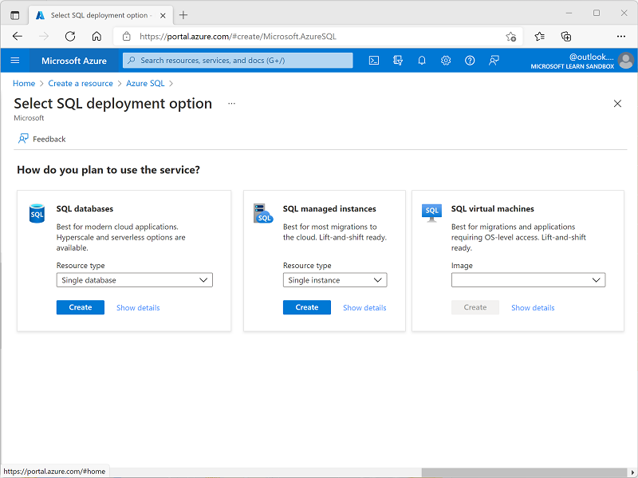
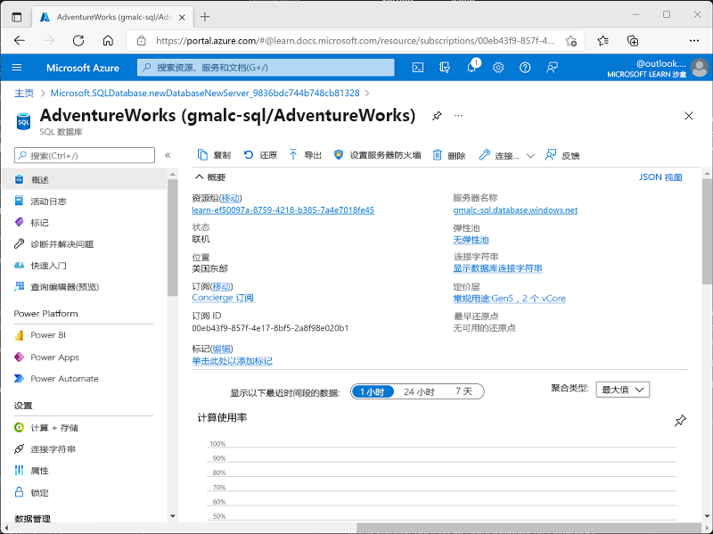
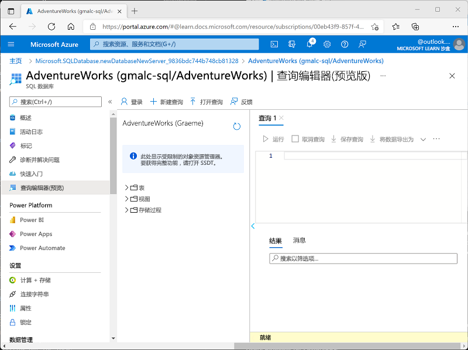
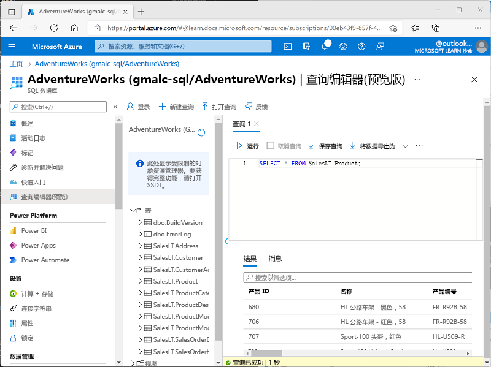

---
lab:
  title: 探索 Azure SQL 数据库
  module: Explore relational data in Azure
---

# <a name="explore-azure-sql-database"></a>探索 Azure SQL 数据库

在本练习中，你将在 Azure 订阅中预配 Azure SQL 数据库资源，然后使用 SQL 查询关系数据库中的表。

本练习大约需要 15 分钟才能完成。

## <a name="before-you-start"></a>开始之前

需要一个你在其中具有管理级权限的 [Azure 订阅](https://azure.microsoft.com/free)。

## <a name="provision-an-azure-sql-database-resource"></a>预配 Azure SQL 数据库资源

1. In the <bpt id="p1">[</bpt>Azure portal<ept id="p1">](https://portal.azure.com?azure-portal=true)</ept>, select <bpt id="p2">**</bpt>&amp;#65291; Create a resource<ept id="p2">**</ept> from the upper left-hand corner and search for <bpt id="p3">*</bpt>Azure SQL<ept id="p3">*</ept>. Then in the resulting <bpt id="p1">**</bpt>Azure SQL<ept id="p1">**</ept> page, select <bpt id="p2">**</bpt>Create<ept id="p2">**</ept>.

1. 查看可用的 Azure SQL 选项，然后在“SQL 数据库”磁贴中，确保选中“单一数据库”并选择“创建”。

    

1. 在“创建 SQL 数据库”页上输入以下值：
    - **订阅**：选择 Azure 订阅。
    - **资源组**：使用你所选择的名称创建新资源组。
    -               数据库名称：AdventureWorks
    - <bpt id="p1">**</bpt>Server<ept id="p1">**</ept>:  Select <bpt id="p2">**</bpt>Create new<ept id="p2">**</ept> and create a new server with a unique name in any available location. Use <bpt id="p1">**</bpt>SQL authentication<ept id="p1">**</ept> and specify your name as the server admin login and a suitably complex password (remember the password - you'll need it later!)
    -               想要使用 SQL 弹性池吗？：否
    -               计算 + 存储：保持不变
    -               备份存储冗余：本地冗余备份存储

1. On the <bpt id="p1">**</bpt>Create SQL Database<ept id="p1">**</ept> page, select <bpt id="p2">**</bpt>Next :Networking &gt;<ept id="p2">**</ept>, and on the <bpt id="p3">**</bpt>Networking<ept id="p3">**</ept> page, in the <bpt id="p4">**</bpt>Network connectivity<ept id="p4">**</ept> section, select <bpt id="p5">**</bpt>Public endpoint<ept id="p5">**</ept>. Then select <bpt id="p1">**</bpt>Yes<ept id="p1">**</ept> for both options in the <bpt id="p2">**</bpt>Firewall rules<ept id="p2">**</ept> section to allow access to your database server from Azure services and your current client IP address.

1. 选择“下一步: 安全性 >”，并将“启用 Microsoft Defender for SQL”选项设置为“现在不启用”  。

1. 选择“下一步: 其他设置 >”，然后在“其他设置”选项卡上，将“使用现有数据”选项设置为“示例”（这将创建一个示例数据库，你可以稍后进行探索）   。

1. 依次选择“查看 + 创建”、“创建”，以创建 Azure SQL 数据库。

1. Wait for deployment to complete. Then go to the resource that was deployed, which should look like this:

    

1. 在页面左侧的窗格中，选择“查询编辑器(预览版)”，然后使用为服务器指定的管理员登录名和密码登录。
    
                  如果显示一条表示“不允许使用客户端 IP 地址”的错误消息，请选择消息末尾的“允许列表 IP …”链接以允许访问并尝试再次登录（虽然之前已将自己计算机的客户端 IP 地址添加到防火墙规则中，但查询编辑器可能会从不同的地址进行连接，具体取决于网络配置。）
    
    查询编辑器如下所示：
    
    

1. 展开 Tables 文件夹，查看数据库中的表。

1. 在“查询 1”窗格中，输入以下 SQL 代码：

    ```sql
    SELECT * FROM SalesLT.Product;
    ```

1. 选择查询上方的“&#9655;运行”以运行该代码，并查看结果，其中应包括 SalesLT.Product 表中的所有行和列，如下所示 ：

    

1. 将 SELECT 语句替换为以下代码，然后选择“&#9655; 运行”以运行新查询并查看结果（其中仅包括 ProductID、Name、ListPrice、ProductCategoryID 列）    ：

    ```sql
    SELECT ProductID, Name, ListPrice, ProductCategoryID
    FROM SalesLT.Product;
    ```

1. 现在尝试以下查询，该查询使用 JOIN 从 SalesLT.ProductCategory 表中获取类别名称：

    ```sql
    SELECT p.ProductID, p.Name AS ProductName,
            c.Name AS Category, p.ListPrice
    FROM SalesLT.Product AS p
    JOIN [SalesLT].[ProductCategory] AS c
        ON p.ProductCategoryID = c.ProductCategoryID;
    ```

1. 关闭查询编辑器窗格，并放弃所做的编辑。

> 提示：如果已完成对 Azure SQL 数据库的探索，可删除在本练习中创建的资源组。
