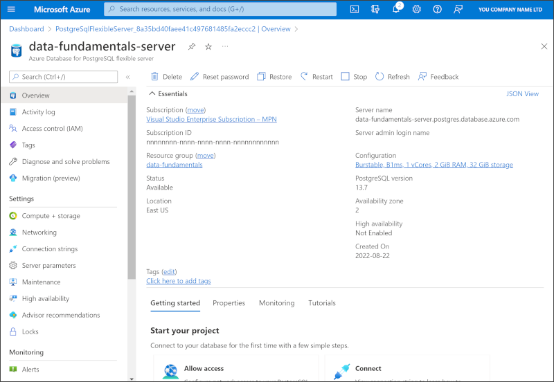

---
lab:
  title: 探索 Azure Database for PostgreSQL
  module: Explore relational data in Azure
---

# 探索 Azure Database for PostgreSQL

在本练习中，你将在 Azure 订阅中预配 Azure Database for PostgreSQL 资源。

完成本实验室大约需要 5 分钟。

## 开始之前

需要一个你在其中具有管理级权限的 [Azure 订阅](https://azure.microsoft.com/free)。

## 预配 Azure Database for PostgreSQL 资源

在本练习中，你将预配 Azure Database for PostgreSQL 资源。

1. 在 Azure 门户的左上角选择“&#65291; 创建资源”，然后搜索“Azure Database for PostgreSQL”。 然后，在出现的“Azure Database for PostgreSQL”页上选择“创建”。

1. 查看可用的“Azure Database for PostgreSQL”选项，然后在“Azure Database for PostgreSQL”磁贴中，选择“灵活服务器(建议)”，然后选择“创建”。

    

1. 在“创建 SQL 数据库”页上输入以下值：
    - **订阅**：选择 Azure 订阅。
    - **资源组**：使用你所选择的名称创建新资源组。
    - 服务器名称：输入唯一名称。
    - **区域**：选择附近的区域。
    - **PostgreSQL 版本**：保持不变。
    - **工作负载类型**：选择“开发”。
    - **计算 + 存储**：保持不变。
    - **可用性区域**：保持不变。
    - **启用高可用性**：保持不变。
    - **管理员用户名**：你的姓名。
    - 密码和确认密码：一个适当复杂的密码 。

1. 选择“下一页:网络”。

1. 在“防火墙规则”下，选择“&#65291; 添加当前客户端 IP 地址” 。

1. 依次选择“查看 + 创建”和“创建”，创建 Azure PostgreSQL 数据库。

1. 等待部署完成。 然后转到已部署的资源，它应该如下所示：

    

1. 查看用于管理 Azure Database for PostgreSQL 资源的选项。

> 提示：如果已完成对 Azure Database for PostgreSQL 的探索，可删除在本练习中创建的资源组。
