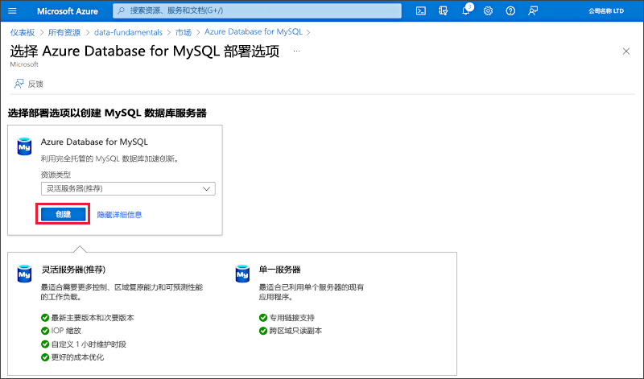
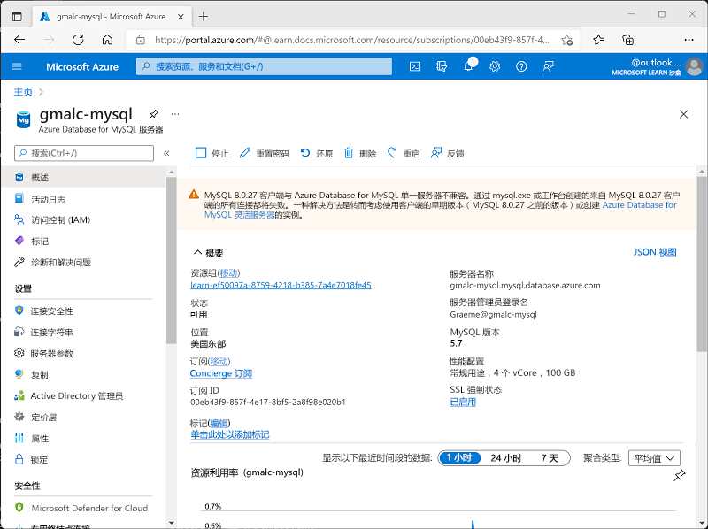

---
lab:
  title: 探索 Azure Database for MySQL
  module: Explore relational data in Azure
---

# 探索 Azure Database for MySQL

在本练习中，你将在 Azure 订阅中预配 Azure Database for MySQL 资源。

完成本实验室大约需要 5 分钟。

## 开始之前

需要一个你在其中具有管理级权限的 [Azure 订阅](https://azure.microsoft.com/free)。

## 预配 Azure Database for MySQL 资源

在本练习中，你将预配 Azure Database for MySQL 资源。

1. In the Azure portal, select <bpt id="p1">**</bpt>&amp;#65291; Create a resource<ept id="p1">**</ept> from the upper left-hand corner and search for <bpt id="p2">*</bpt>Azure Database for MySQL<ept id="p2">*</ept>. Then in the resulting <bpt id="p1">**</bpt>Azure Database for MySQL<ept id="p1">**</ept> page, select <bpt id="p2">**</bpt>Create<ept id="p2">**</ept>.

1. Review the Azure Database for MySQL options that are available. Then for <bpt id="p1">**</bpt>Resource type<ept id="p1">**</ept>, select <bpt id="p2">**</bpt>Flexible Server<ept id="p2">**</ept> and select <bpt id="p3">**</bpt>Create<ept id="p3">**</ept>.

    

1. 在“创建 SQL 数据库”页上输入以下值：
    - **订阅**：选择 Azure 订阅。
    - **资源组**：使用你所选择的名称创建新资源组。
    - 服务器名称：输入唯一名称。
    - 区域：你附近的任何可用位置。
    - MySQL 版本：保持不变。
    - 工作负载类型：用于开发或兴趣项目。
    - **计算 + 存储**：保持不变。
    - **可用性区域**：保持不变。
    - **启用高可用性**：保持不变。
    -               管理员用户名：你的姓名
    -               密码和确认密码：一个适当复杂的密码

1. 选择“下一页:网络”。

1. 在“防火墙规则”下，选择“&#65291; 添加当前客户端 IP 地址” 。

1. 依次选择“查看 + 创建”、“创建”，以创建 Azure MySQL 数据库。

1. Wait for deployment to complete. Then go to the resource that was deployed, which should look like this:

    

1. 查看用于管理 Azure Database for MySQL 资源的选项。

> 提示：如果已完成 Azure Database for MySQL 浏览，则可以删除在本练习中创建的资源组。
