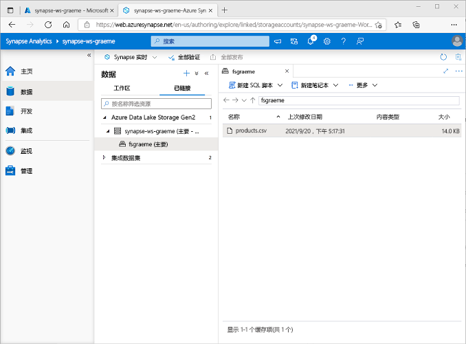
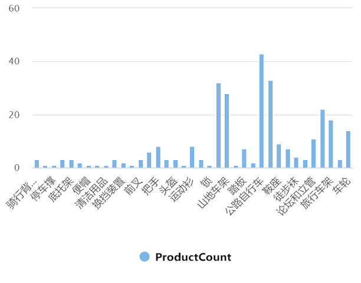
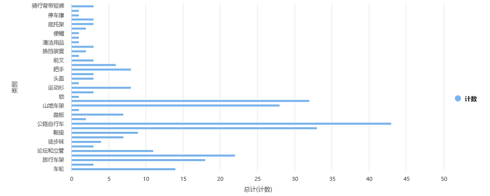

---
lab:
  title: 使用 Azure Synapse Analytics 探索 Azure 中的数据分析
  module: Explore fundamentals of large-scale data warehousing
---

# <a name="explore-data-analytics-in-azure-with-azure-synapse-analytics"></a>使用 Azure Synapse Analytics 探索 Azure 中的数据分析

在本练习中，你将在 Azure 订阅中预配一个 Azure Synapse Analytics 工作区，并使用它来引入和查询数据。

完成本实验室大约需要 30 分钟。

## <a name="before-you-start"></a>开始之前

需要一个你在其中具有管理级权限的 [Azure 订阅](https://azure.microsoft.com/free)。

## <a name="provision-an-azure-synapse-analytics-workspace"></a>预配 Azure Synapse Analytics 工作区

要使用 Azure Synapse Analytics，必须在 Azure 订阅中预配一个 Azure Synapse Analytics 工作区资源。

1. 访问 [https://portal.azure.com](https://portal.azure.com?azure-portal=true) 以打开 Azure 门户，然后使用与你的 Azure 订阅关联的凭据登录。

    > <bpt id="p1">**</bpt>Tip<ept id="p1">**</ept>:  Ensure you are working in the directory containing your subscription - indicated at the top right under your user ID. If not, select the user icon and switch directory.

2. 在 Azure 门户的“主页”上，使用“+ 创建资源”图标创建一个新资源。
3. 搜索“Azure Synapse Analytics”，并创建一个新的 Azure Synapse Analytics 资源，使其包含以下设置：
    - **订阅**：Azure 订阅
        - 资源组：创建一个具有合适名称的新资源组，如名为“synapse-rg”
        - 受管理资源组：输入适当的名称，例如“synapse-managed-rg”。
    - 工作区名称：输入一个唯一的工作区名称，例如 synapse-ws-<your_name>。
    - **区域**：*选择以下任一区域*：
        - 澳大利亚东部
        - 美国中部
        - 美国东部 2
        - 北欧
        - 美国中南部
        - 东南亚
        - 英国南部
        - 西欧
        - 美国西部
        - WestUS 2
    - 选择 Data Lake Storage Gen 2：从订阅
        - 帐户名：新建一个具有唯一名称的帐户，例如“datalake<your_name>”。
        - 文件系统名称：新建一个具有唯一名称的文件系统，例如“fs<your_name>”。

    > <bpt id="p1">**</bpt>Note<ept id="p1">**</ept>: A Synapse Analytics workspace requires two resource groups in your Azure subscription; one for resources you explicitly create, and another for managed resources used by the service. It also requires a Data Lake storage account in which to store data, scripts, and other artifacts.

4. 输入这些详细信息后，选择“审阅并创建”，然后选择“创建”来创建工作区。
5. 等待工作区的创建 - 此操作可能需要约 5 分钟。
6. 部署完成后，转到创建的资源组，并注意它包含你的 Synapse Analytics 工作区和一个 Data Lake Storage 帐户。
7. 选择 Synapse 工作区，并在其“概述”页的“打开 Synapse Studio”卡中选择“打开”，在新浏览器选项卡中打开 Synapse Studio。Synapse Studio 是一个基于 Web 的界面，可用于处理 Synapse Analytics 工作区。
8. 在 Synapse Studio 左侧，使用 &rsaquo;&rsaquo; 图标展开菜单，这将显示 Synapse Studio 中用于管理资源和执行数据分析任务的不同页面，如下所示：

    

## <a name="ingest-data"></a>引入数据

可以使用 Azure Synapse Analytics 执行的关键任务之一是定义管道，将数据从各种源传输到你的工作区（如有必要还会进行转换）以进行分析。

1. 在 Synapse Studio 的主页上，选择“引入”，然后选择“内置复制任务”以打开“复制数据工具”工具。
2. 在“复制数据”工具的“属性”步骤上，确保已选中“内置复制任务”和“立即运行一次”，然后单击“下一步 >”。
3. 在“源”步骤的“数据集”子步骤中，选择以下设置：
    -               源类型：全部
    -               连接：创建新的连接，然后在显示的“链接服务”窗格中，在“文件”选项卡上，选择“HTTP”。然后，使用以下设置继续并创建与数据文件的连接：
        - 名称：AdventureWorks 产品
        - 说明：通过 HTTP 提供的产品列表
        - 通过集成运行时连接：AutoResolveIntegrationRuntime
        - 基 URL：`https://raw.githubusercontent.com/MicrosoftLearning/DP-900T00A-Azure-Data-Fundamentals/master/Azure-Synapse/products.csv`
        - 服务器证书验证：启用
        - 身份验证类型：匿名
4. 创建连接后，在“源/数据集”子步骤上，确保选择以下设置，然后选择“下一步 >”：
    - 相对 URL：留空
    - 请求方法：GET
    - 其他标题：留空
    - 二进制副本：处于<u>未</u>选择状态
    - 请求超时：留空
    - 最大并发连接数：留空
5. 在“源”步骤的“配置”子步骤中，选择“预览数据”，查看管道将引入的产品数据预览，然后关闭预览。
6. 预览数据后，在“源/配置”步骤上确保选择以下设置，然后选择“下一步 >”：
    - **文件格式**： DelimitedText
    - 列分隔符：逗号 (,)
    - 行分隔符：换行符 (\n)
    - 首行用作标题：已选择
    - 压缩类型：无
7. 在“目标”步骤的“数据集”子步骤中，选择以下设置：
    -               目标类型：Azure Data Lake Storage Gen 2
    -               连接：选择与数据湖存储的现有连接，（这是在你创建工作区时为你创建的）。
8. 选择连接后，在“目标/数据集”步骤中，确保选择以下设置，然后选择“下一步 >” ：
    - 文件夹路径：浏览到文件系统文件夹
    - 文件名：products.csv
    - 复制行为：无
    - 最大并发连接数：留空
    - 块大小 (MB)：留空
9. On the <bpt id="p1">**</bpt>Target<ept id="p1">**</ept> step, in the <bpt id="p2">**</bpt>Configuration<ept id="p2">**</ept> substep, ensure that the following properties are selected. Then select <bpt id="p1">**</bpt>Next &gt;<ept id="p1">**</ept>:
    - **文件格式**： DelimitedText
    - 列分隔符：逗号 (,)
    - 行分隔符：换行符 (\n)
    - 将标题添加到文件：已选择
    - 压缩类型：无
    - 每个文件的最大行数：留空
    - 文件名前缀：留空
10. 在“设置”步骤上，输入以下设置，然后单击“下一步 >”：
    - 任务名称：复制产品
    - 任务说明：复制产品数据
    - 容错：留空
    - 启用日志记录：处于<u>未</u>选择状态
    - 启用暂存：处于<u>未</u>选择状态
11. 在“查看并完成”步骤的“查看”子步骤上，阅读摘要，然后单击“下一步 >”。
12. 在“部署”步骤中，等待管道部署完成，然后单击“完成”。
13. 在 Synapse Studio 中，选择“监视”页，然后在“管道运行”选项卡中等待“复制产品”管道完成，状态为“成功”（可以使用“管道运行”页上的“&#8635; 刷新”按钮来刷新状态）    。
14. On the <bpt id="p1">**</bpt>Data<ept id="p1">**</ept> page, select the <bpt id="p2">**</bpt>Linked<ept id="p2">**</ept> tab and expand the <bpt id="p3">**</bpt>Azure Data Lake Storage Gen 2<ept id="p3">**</ept> hierarchy until you see the file storage for your Synapse workspace. Then select the file storage to verify that a file named <bpt id="p1">**</bpt>products.csv<ept id="p1">**</ept> has been copied to this location, as shown here:

    

## <a name="use-a-sql-pool-to-analyze-data"></a>使用 SQL 池来分析数据

Now that you've ingested some data into your workspace, you can use Synapse Analytics to query and analyze it. One of the most common ways to query data is to use SQL, and in Synapse Analytics you can use a <bpt id="p1">*</bpt>SQL pool<ept id="p1">*</ept> to run SQL code.

1. 在 Synapse Studio 中，右键单击 Synapse 工作区文件存储中的“products.csv”文件，指向“新建 SQL 脚本”，然后选择“选择前 100 行”。
2. 在打开的“SQL 脚本 1”窗格中，查看已生成的 SQL 代码，应如下所示：

    ```SQL
    -- This is auto-generated code
    SELECT
        TOP 100 *
    FROM
        OPENROWSET(
            BULK 'https://datalakexx.dfs.core.windows.net/fsxx/products.csv',
            FORMAT = 'CSV',
            PARSER_VERSION='2.0'
        ) AS [result]
    ```

    此代码将从你导入的文本文件中打开一个行集，并检索前 100 行数据。

3. 在“连接到”列表中，确保已选中“内置”，这表示通过工作区创建的内置 SQL 池。
4. 在工具栏上，使用“▷ 运行”按钮运行 SQL 代码，并查看结果，结果应如下所示：

    | C1 | c2 | c3 | c4 |
    | -- | -- | -- | -- |
    | ProductID | ProductName | 类别 | ListPrice |
    | 771 | Mountain-100 Silver, 38 | 山地自行车 | 3399.9900 |
    | 772 | Mountain-100 Silver, 42 | 山地自行车 | 3399.9900 |
    | ... | ... | ... | ... |

5. Note the results consist of four columns named C1, C2, C3, and C4; and that the first row in the results contains the names of the data fields. To fix this problem, add a HEADER_ROW = TRUE parameters to the OPENROWSET function as shown here (replacing <bpt id="p1">*</bpt>datalakexx<ept id="p1">*</ept> and <bpt id="p2">*</bpt>fsxx<ept id="p2">*</ept> with the names of your data lake storage account and file system), and then rerun the query:

    ```SQL
    SELECT
        TOP 100 *
    FROM
        OPENROWSET(
            BULK 'https://datalakexx.dfs.core.windows.net/fsxx/products.csv',
            FORMAT = 'CSV',
            PARSER_VERSION='2.0',
            HEADER_ROW = TRUE
        ) AS [result]
    ```

    现在，结果如下所示：

    | ProductID | ProductName | 类别 | ListPrice |
    | -- | -- | -- | -- |
    | 771 | Mountain-100 Silver, 38 | 山地自行车 | 3399.9900 |
    | 772 | Mountain-100 Silver, 42 | 山地自行车 | 3399.9900 |
    | ... | ... | ... | ... |

6. 按如下所示修改查询（将 datalakexx 和 fsxx 替换为 Data Lake Storage 帐户和文件系统的名称）：

    ```SQL
    SELECT
        Category, COUNT(*) AS ProductCount
    FROM
        OPENROWSET(
            BULK 'https://datalakexx.dfs.core.windows.net/fsxx/products.csv',
            FORMAT = 'CSV',
            PARSER_VERSION='2.0',
            HEADER_ROW = TRUE
        ) AS [result]
    GROUP BY Category;
    ```

7. 运行修改后的查询，它应该返回一个包含每个类别中产品数量的结果集，如下所示：

    | 类别 | ProductCount |
    | -- | -- |
    | Bib Shorts | 3 |
    | 自行车车架 | 1 |
    | ... | ... |

8. In the <bpt id="p1">**</bpt>Properties<ept id="p1">**</ept> pane for <bpt id="p2">**</bpt>SQL Script 1<ept id="p2">**</ept>, change the <bpt id="p3">**</bpt>Name<ept id="p3">**</ept> to <bpt id="p4">**</bpt>Count Products by Category<ept id="p4">**</ept>. Then in the toolbar, select <bpt id="p1">**</bpt>Publish<ept id="p1">**</ept> to save the script.

9. 关闭“产品计数(按类别)”脚本窗格。

10. 在 Synapse Studio 中，选择“开发”页，注意到已发布的“产品计数(按类别)”SQL 脚本已保存在那里。

11. Select the <bpt id="p1">**</bpt>Count Products by Category<ept id="p1">**</ept> SQL script to reopen it. Then ensure that the script is connected to the <bpt id="p1">**</bpt>Built-in<ept id="p1">**</ept> SQL pool and run it to retrieve the product counts.

12. 在“结果”窗格中，选择“图表”视图，然后为图表选择以下设置：
    - 图表类型：柱形图
    - 类别列：类别
    - 图例(系列)列：ProductCount
    - 图例位置：靠下居中
    - 图例(系列)标签：留空
    - 图例(系列)最小值：留空
    - 图例(系列)最大值：留空
    - 类别标签：留空

    生成的图表应如下所示：

    

## <a name="use-a-spark-pool-to-analyze-data"></a>使用 Spark 池来分析数据

While SQL is a common language for querying structured datasets, many data analysts find languages like Python useful to explore and prepare data for analysis. In Azure Synapse Analytics, you can run Python (and other) code in a <bpt id="p1">*</bpt>Spark pool<ept id="p1">*</ept>; which uses a distributed data processing engine based on Apache Spark.

1. 在 Synapse Studio 中，选择“管理”页。
2. 选择“Apache Spark 池”选项卡，然后使用“+ 新建”图标，新建一个具有以下设置的 Spark 池：
    - Apache Spark 池名称：spark
    - 节点大小系列：内存优化
    - 节点大小：小(4 个 vCore/32 GB)
    - 自动缩放：已启用
    - 节点数：3----3
3. 审阅并创建 Spark 池，然后等待它部署完成（可能需要几分钟时间）。
4. When the Spark pool has been deployed, in Synapse Studio, on the <bpt id="p1">**</bpt>Data<ept id="p1">**</ept> page, browse to the file system for your Synapse workspace. Then right-click <bpt id="p1">**</bpt>products.csv<ept id="p1">**</ept>, point to <bpt id="p2">**</bpt>New notebook<ept id="p2">**</ept>, and select <bpt id="p3">**</bpt>Load to DataFrame<ept id="p3">**</ept>.
5. 在打开的“笔记本 1”窗格的“附加到”列表中，选择先前创建的“spark”Spark 池，并确保将“语言”设置为“PySpark (Python)”。
6. 查看笔记本中的第一个（也是唯一一个）单元格中的代码，它应该如下所示：

    ```Python
    %%pyspark
    df = spark.read.load('abfss://fsxx@datalakexx.dfs.core.windows.net/products.csv', format='csv'
    ## If header exists uncomment line below
    ##, header=True
    )
    display(df.limit(10))
    ```

7.                  提示：确保使用右上方用户 ID 下显示的包含订阅的目录。

    > 注意：如果由于 Python 内核尚不可用而发生错误，请再次运行该单元。

8. 最终，结果应显示在单元格下面，应如下所示：

    | c0 | c1 | _c2_ | _c3_ |
    | -- | -- | -- | -- |
    | ProductID | ProductName | 类别 | ListPrice |
    | 771 | Mountain-100 Silver, 38 | 山地自行车 | 3399.9900 |
    | 772 | Mountain-100 Silver, 42 | 山地自行车 | 3399.9900 |
    | ... | ... | ... | ... |

9. 取消注释“,header=True”这一行（因为 products.csv 文件的第一行包含列标题），因此代码如下所示：

    ```Python
    %%pyspark
    df = spark.read.load('abfss://fsxx@datalakexx.dfs.core.windows.net/products.csv', format='csv'
    ## If header exists uncomment line below
    , header=True
    )
    display(df.limit(10))
    ```

10. 重新运行单元格，并验证结果是否如下所示：

    | ProductID | ProductName | 类别 | ListPrice |
    | -- | -- | -- | -- |
    | 771 | Mountain-100 Silver, 38 | 山地自行车 | 3399.9900 |
    | 772 | Mountain-100 Silver, 42 | 山地自行车 | 3399.9900 |
    | ... | ... | ... | ... |

    请注意，再次运行单元格所花的时间会更短，因为 Spark 池已经启动了。

11. 在结果下，使用“+ 代码”图标向笔记本添加一个新的代码单元格。
12. 在新的空代码单元格中，添加以下代码：

    ```Python
    df_counts = df.groupBy(df.Category).count()
    display(df_counts)
    ```

13. 选择左侧的“&#9655; 运行”来运行新代码单元，并查看结果，结果应如下所示：

    | 类别 | count |
    | -- | -- |
    | 耳机 | 3 |
    | 车轮 | 14 |
    | ... | ... |

14. 如果没有，请选择用户图标并切换目录。

    

15. 关闭“笔记本 1”窗格并放弃所做的更改。

## <a name="delete-azure-resources"></a>删除 Azure 资源

你已完成对 Azure Synapse Analytics 的探索，现在应删除已创建的资源，以避免产生不必要的 Azure 成本。

1. 关闭 Synapse Studio 浏览器选项卡并返回到 Azure 门户。
2. 在 Azure 门户的“主页”上，选择“资源组”。
3. 选择 Synapse Analytics 工作区的资源组（不是受管理资源组），并确认它包含 Synapse 工作区、存储帐户和工作区的 Spark 池。
4. 在资源组的“概述”页的顶部，选择“删除资源组”。
5. 输入资源组名称以确认要删除该资源组，然后选择“删除”。

    几分钟后，你的 Azure Synapse 工作区及其关联的受管理工作区将被删除。
