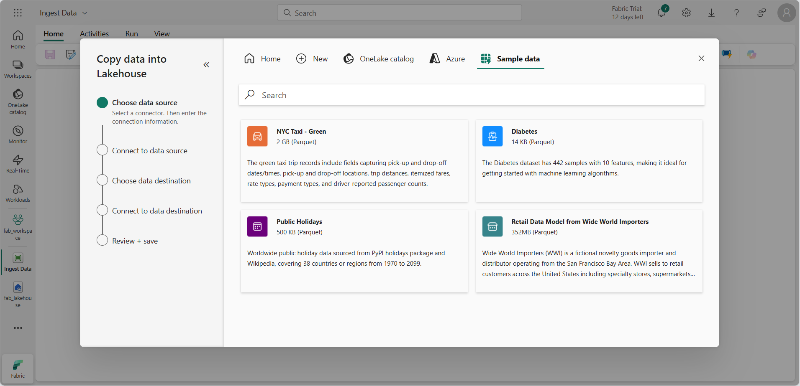
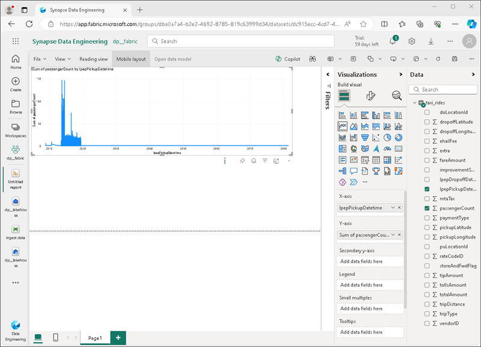

---
lab:
  title: 探索 Microsoft Fabric 中的数据分析
  module: Explore fundamentals of large-scale data analytics
---

# 探索 Microsoft Fabric 中的数据分析

在本练习中，你将探索 Microsoft Fabric 湖屋中的数据引入和分析。

完成本实验室大约需要 25 分钟。

> 注意：需要 Microsoft Fabric 许可证才能完成本练习。 有关如何启用免费 Fabric 试用版许可证的详细信息，请参阅 [Fabric 入门](https://learn.microsoft.com/fabric/get-started/fabric-trial)。 需要 Microsoft 学校或工作帐户才能执行此操作 。 如果没有该帐户，可以[注册 Microsoft Office 365 E3 或更高版本的试用版](https://www.microsoft.com/microsoft-365/business/compare-more-office-365-for-business-plans)。

*首次使用任何 Microsoft Fabric 功能时，可能会出现提示。消除这些内容。*

## 创建工作区

在 Fabric 中处理数据之前，创建一个已启用的 Fabric 试用版的工作区。

1. 在 `https://app.fabric.microsoft.com` 登录到 [Microsoft Fabric](https://app.fabric.microsoft.com)。
1. 在菜单栏左下角，切换到“数据工程”**** 体验。

    

1. 在左侧菜单栏中，选择“工作区”（图标类似于 &#128455;）。
1. 新建一个工作区并为其指定名称，并在“高级”部分选择包含 Fabric 容量（试用版、高级版或 Fabric）的许可模式  。
1. 打开新工作区时，它应为空。

    

## 创建湖屋

现在已经有了工作区，可以为数据文件创建数据湖屋了。

1. 在工作区主页中，使用所选名称创建一个新的“湖屋”****。

    大约一分钟后，一个新的湖屋创建完成：

    

1. 查看新的湖屋，并注意使用左侧的湖屋资源管理器窗格可浏览湖屋中的表和文件：
    - Tables 文件夹包含可以使用 SQL 查询的表。 Microsoft Fabric 湖屋中的表基于 Apache Spark 中常用的开源 Delta Lake 文件格式。
    - Files 文件夹包含湖屋的 OneLake 存储中未与托管增量表关联的数据文件。 还可以在此文件夹中创建快捷方式，以引用存储在外部的数据。

    目前，湖屋中没有表或文件。

## 引入数据

引入数据的一种简单方法是使用管道中的“复制数据”活动从源中提取数据并将其复制到湖屋中的文件。

1. 在湖屋的“主页”**** 上的“获取数据”**** 菜单中选择“新建数据管道”****，并创建名为“引入数据”**** 的新数据管道。
1. 在复制数据**** 向导的“选择数据源”**** 页上，选择“示例数据”****，然后选择“NYC Taxi - Green”**** 示例数据集。

    

1. 在“连接到数据源”**** 页上查看数据源中的表。 应该有一个表，其中包含纽约市出租车行程的详细信息。 然后选择“下一步”以跳转至“选择数据目标”页 。
1. 在“选择数据目标”页上，选择现有湖屋。 然后，选择“下一步”。
1. 设置以下数据目标选项，然后选择“下一步”：
    - **根文件夹**：Tables
    - **加载设置**：加载到新表
    - **目标表名称**：taxi_rides *（可能需要等待列映射预览显示，然后才能更改此项）*
    - **列映射**：保持默认映射不变
    - **启用分区**：未选中
1. 在“查看 + 保存”页上，确保选中“立即开始数据传输”选项，然后选择“保存 + 运行”  。

    将创建一个包含“复制数据”活动的新管道，如下所示：

    

    管道开始运行时，可以在管道设计器下的“输出”窗格中监视其状态。 使用 “&#8635;”****（“刷新”**）图标刷新状态，并等待它成功（可能需要 10 分钟或更长时间）。

1. 在左侧的中心菜单栏中，选择你的湖屋。
1. 在**主页**的**湖屋资源管理器**窗格中的**表**节点的 **...** 菜单中，选择**刷新**，然后展开**表**以验证是否已创建 **taxi_rides** 表。

    > **注意**：如果新表被列为“无法识别”** 的表，请使用“刷新”**** 菜单选项刷新视图。

1. 选择 taxi_rides **** 表以查看其内容。

    

## 查询湖屋中的数据

将数据引入湖屋中的表后，可以使用 SQL 对其进行查询。

1. 在湖屋页面的右上角，从**湖屋**视图切换到湖屋的 **SQL 分析终结点**。

1. 在工具栏中选择“新建 SQL 查询”。 然后在查询编辑器中输入以下 SQL 代码：

    ```sql
    SELECT  DATENAME(dw,lpepPickupDatetime) AS Day,
            AVG(tripDistance) As AvgDistance
    FROM taxi_rides
    GROUP BY DATENAME(dw,lpepPickupDatetime)
    ```

1. 选择“&#9655;Run”**** 按钮运行查询并查看结果，其中应包括每周每一天的平均行程距离。

    

## 可视化湖屋中的数据

Microsoft Fabric 湖屋将所有表整理至语义数据模型中，该数据模型可用于创建可视化效果和报表。

1. 在页面左下角的**资源管理器**窗格下选择**模型**选项卡，查看湖屋中表的数据模型（这包括系统表以及 **taxi_ride**）。
1. 在工具栏中，选择“新建报表”**** 以基于 taxi_rides**** 创建新报表。
1. 请在报表设计器中执行以下操作：
    1. 在“数据”**** 窗格中，展开 taxi_rides**** 表，然后选择 lpepPickupDatetime**** 和 passengerCount**** 字段。
    1. 在“可视化效果”**** 窗格中，选择“折线图”**** 可视化效果。 然后，确保 X 轴**** 包含 lpepPickupDatetime**** 字段，Y**** 轴包含 passengerCount**** 的总和。

        

    > **提示**：可以使用 >> 图标隐藏报表设计器窗格，以便更清楚地查看报表。

1. 在“文件”**** 菜单上选择“保存”****，将报表另存为 Fabric 工作区中的 Taxi Rides Report****。

    现在可以关闭包含该报表的浏览器选项卡，返回到湖屋。 可以在 Microsoft Fabric 门户的工作区页面中找到报表。

## 清理资源

如果已完成 Microsoft Fabric 探索，则可以删除为此练习创建的工作区。

1. 在左侧栏中，选择工作区的图标以查看其包含的所有项。
2. 在工具栏上的“...”菜单中，选择“工作区设置” 。
3. 在“其他”部分中，选择“删除此工作区” 。
