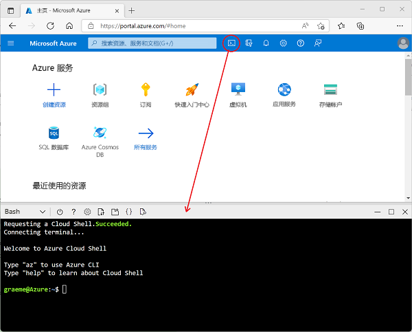

---
lab:
  title: 探索 Azure 流分析
  module: Explore data analytics in Azure
ms.openlocfilehash: 925607333098d0774839d705d4e055a78e32de27
ms.sourcegitcommit: e73a39e323ef061919b58561ff1afdca876ad2b5
ms.translationtype: HT
ms.contentlocale: zh-CN
ms.lasthandoff: 04/07/2022
ms.locfileid: "141493687"
---
## 探索 Azure 流分析

在本练习中，你将在 Azure 订阅中预配 Azure 流分析作业，并使用它来处理实时数据流。

> **注意**：本练习是 Microsoft Learn 模块的一部分，包含使用沙盒 Azure 订阅的选项。 但是，如果你正在完成作为讲师引导式课程的一部分的本练习，则应使用课程中提供的 Azure 订阅，而不是沙盒。

在 Microsoft Learn 上开始练习之前，需要为 Azure 订阅准备一个 Cloud Shell 环境。

1. 使用 Azure 订阅凭据在 [Azure 门户](https://portal.azure.com) (`https://portal.azure.com`) 中登录到 Azure 订阅。
2. 使用页面顶部搜索栏右侧的 [\>_] 按钮在 Azure 门户中创建新的 Cloud Shell，在出现提示时选择 Bash 环境并创建存储 。 Cloud Shell 在 Azure 门户底部的窗格中提供命令行界面，如下所示：

    

3. 请注意，可以通过拖动窗格顶部的分隔条或使用窗格右上角的 &#8212;、&#9723; 或 X 图标来调整 Cloud Shell 的大小，以最小化、最大化和关闭窗格  。 有关如何使用 Azure Cloud Shell 的详细信息，请参阅 [Azure Cloud Shell 文档](https://docs.microsoft.com/azure/cloud-shell/overview)。

4. 现在，你已准备好在 Microsoft Learn 上完成练习 - 只需使用 Azure 门户中的 Cloud Shell，而不是 Learn 模块中的（空白）（这是为使用沙盒订阅的自定进度的学习者提供的）。

    使用下面的链接在 Microsoft Learn 上打开练习。

    **[转到 Microsoft Learn](https://docs.microsoft.com/learn/modules/explore-fundamentals-stream-processing/5-exercise-stream-analytics#create-azure-resources)**

> **进阶学习**：如果以后有时间，请考虑返回此 Microsoft Learn 模块并尝试其中包含的其他练习，其中包括探索 Spark Streaming 和 Azure Synapse Data Explorer。
