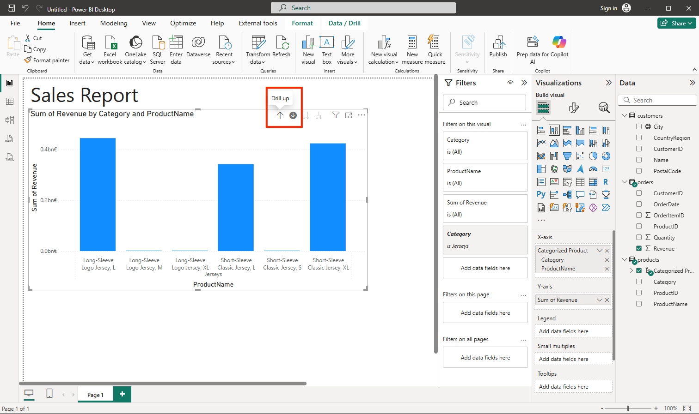

---
lab:
  title: 使用 Power BI 探索数据可视化的基础知识
  module: Explore fundamentals of data visualization
---

# 使用 Power BI 探索数据可视化的基础知识

在本练习中，你将使用 Microsoft Power BI Desktop 创建包含交互式数据可视化效果的数据模型和报表。

完成本实验室大约需要 20 分钟。

## 开始之前

需要一个你在其中具有管理级权限的 [Azure 订阅](https://azure.microsoft.com/free)。

### 安装 Power BI Desktop

如果你的 Windows 计算机上尚未安装 Microsoft Power BI Desktop，则可以免费下载和安装。

1. 从 [https://aka.ms/power-bi-desktop](https://aka.ms/power-bi-desktop?azure-portal=true) 下载 Power BI Desktop 安装程序。
1. 下载文件后，将其打开，然后使用安装向导在计算机上安装 Power BI Desktop。 安装可能需要几分钟时间。

## 导入数据

1. 打开 Power BI Desktop。 应用程序界面应如下所示：

    

    现在，你可以导入报表数据。

1. 在 Power BI Desktop 的欢迎屏幕上，选择“获取数据”，然后在数据源列表中选择“Web”，再选择“连接”。

    

1. 在“来自 Web”对话框中，输入以下 URL，然后选择“确定”：

    ```
    https://github.com/MicrosoftLearning/DP-900T00A-Azure-Data-Fundamentals/raw/master/power-bi/customers.csv
    ```

1. 在“访问 Web 内容”对话框中，选择“连接”。

1. 验证该 URL 是否打开包含客户数据的数据集，如下所示。 然后选择“加载”，将数据加载到报表的数据模型中。

    

1. 在 Power BI Desktop 主窗口的“数据局”菜单中，选择“获取数据”，然后选择 Web ：

    

1. 在“来自 Web”对话框中，输入以下 URL，然后选择“确定”：

    ```
    https://github.com/MicrosoftLearning/DP-900T00A-Azure-Data-Fundamentals/raw/master/power-bi/products.csv
    ```

1. 在对话框中，选择“加载”，将此文件中的产品数据加载到数据模型中。

1. 重复上述三个步骤，从以下 URL 导入包含订单数据的第三个数据集：

    ```
    https://github.com/MicrosoftLearning/DP-900T00A-Azure-Data-Fundamentals/raw/master/power-bi/orders.csv
    ```

## 了解数据模型

导入的三个数据表已加载到数据模型中，现在你可以查看并对其进行优化。

1. 在 Power BI Desktop 的左侧边缘，选择“模型”选项卡，然后排列模型中的表以便查看。 可使用 >> 图标隐藏右侧的窗格：

    

1. 在 orders 表中，选择“Revenue”字段，然后在“属性”窗格中，将其“格式”属性设置为“Currency”：

    

    此步骤将确保收入值在报表可视化效果中显示为货币。

1. 在 products 表中，右键单击“Category”字段（或打开它的 &vellip; 菜单），然后选择“创建层次结构”  。 此步骤将创建一个名为 **Category Hierarchy** 的层次结构。 可能需要在 products 表中展开或滚动才能看到它 - 在“字段”窗格中也能看到它 ：

    

1. 在 products 表中，右键单击 ProductName 字段（或打开它的 &vellip; 菜单），然后选择“添加到层次结构” > “Category Hierarchy”   。 这会将“ProductName”字段添加到之前创建的层次结构中。
1. 在“字段”窗格中，右键单击“Category Hierarchy”（或打开它的“…”菜单）并选择“重命名”。 然后将层次结构重命名为 Categorized Product。

    

1. 在左侧边缘，选择“数据视图”选项卡，然后在“数据”窗格中，选择 customers 表  。
1. 选择“City”列标题，然后将其“数据类别”属性设置为“City”：

    

    此步骤将确保将此列中的值解释为城市名称，在你打算包括地图可视化效果时，这很有用。

## 创建报表

现在，差不多可以开始创建报表。 首先需要检查一些设置，确保所有可视化效果都已启用。

1. 在“文件”菜单上，选择“选项和设置”。 然后选择“选项”，在“安全性”部分中，确保“使用地图和着色地图视觉对象”已启用并选择“确定”。

    

    此设置确保在报表中能够包括地图可视化效果。

1. 在左侧边缘，选择“报表视图”选项卡并查看报表设计界面。

    

1. 在功能区中，在报表设计图面上方选择“文本框”，然后将包含“Sales Report”文本的文本框添加到报表。 设置此文本格式为粗体，字体大小为 32。

    

1. 选择报表上的任意空白区域可取消选择文本框。 然后在“数据”窗格中，展开“Products”，然后选择“Categorized Products”字段  。 此步骤会向报表添加一个表。

    

1. 在表仍处于选定状态的情况下，在“数据”窗格中展开“Orders”，然后选择“Revenue”  。 Revenue 列会添加到表中。 可能需要扩展表的大小才能看到它。

    按照在模型中指定的，收入的格式为货币。 但由于没有指定小数位数，因此这些值将包含小数。 这不会影响将要创建的可视化效果，但你可以根据需要返回“模型”或“数据”选项卡来更改小数位数 。

    

1. 在表仍处于选定状态的情况下，在“可视化”窗格中选择“堆积柱形图”可视化效果。 该表更改为按类别显示收入的柱形图。

    

1. 在所选柱形图上方，选择 &#8595; 图标启用向下钻取。 然后在柱形图中，选择第二列以向下钻取并查看该类别中各个产品的收入。 此功能是可行的，因为你定义了类别和产品的层次结构。

    

1. 使用 &#x2191; 图标向上钻取到类别级别。 然后选择 (&#8595;) 图标关闭向下钻取功能 。
1. 选择报表的空白区域，然后在“数据”窗格中，选择 orders 表中的“Quantity”字段和 products 表中的“Category”字段    。 此步骤会生成另一个柱形图，其中按产品类别显示销售数量。
1. 选中新的柱形图后，在“可视化”窗格中选择“饼图”，然后调整饼图大小并将其放置在按类别显示的收入旁边。

    

1. 选择报表的空白区域，然后在“数据”窗格中，选择 customers 表中的“City”字段和 orders 表中的“Revenue”字段    。 这会生成一个地图，其中按城市显示销售收入。 根据需要重新排列可视化效果和调整其大小：

    

1. 请注意，在地图中，你可拖动、双击、使用鼠标滚轮，或在触摸屏上双指捏合和拖动来进行交互。 然后选择一个特定的城市，注意报表中的其他可视化效果已改为突出显示所选城市的数据。

    

1. 在“文件”菜单中，选择“保存”。 然后使用相应的 .pbix 文件名保存该文件。 你可以在空闲时打开文件，进一步了解数据建模和可视化效果。

如果你有 [Power BI 服务](https://www.powerbi.com/?azure-portal=true)订阅，则可以登录到你的帐户并将报表发布到 Power BI 工作区。 
